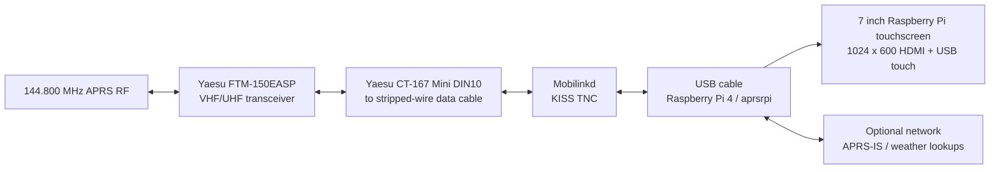

# APRS RPi Kiosk

A Go-native APRS monitor with a Vue.js full-screen kiosk frontend. It reads and writes KISS frames from a bidirectional serial or Bluetooth RFCOMM TNC.

## Example station setup

This is an example mobile/base APRS kiosk using a Yaesu FTM-150EASP as the RF transceiver. `aprsrpi` runs on a Raspberry Pi 4, receives and transmits APRS through a Mobilinkd KISS TNC, and presents received traffic on the attached touchscreen.



### Indicative bill of materials

| Item | Example used in this station | Purpose | Notes |
| --- | --- | --- | --- |
| Transceiver | Yaesu FTM-150EASP | RF receive and transmit | Use an appropriate antenna, power supply, and operating licence for the band and location. |
| Radio interface cable | Yaesu CT-167 Mini DIN10-to-stripped-wire data cable | Carries receive audio, transmit audio, ground, and PTT/control connections | This cable is also marketed for FTM-100, FTM-300, and FTM-400 radios. Confirm the FTM-150EASP connector pinout in the Yaesu documentation before wiring. Do not assume wire colours or pin assignments. |
| KISS TNC | Mobilinkd | Converts radio audio/PTT to bidirectional KISS frames | In this example it connects to the Pi by USB cable, providing a bidirectional serial KISS connection. |
| Computer | Raspberry Pi 4 | Runs the Go backend and Chromium kiosk | Raspberry Pi OS 64-bit and a reliable 5 V power supply are recommended. |
| Display | 7 inch Raspberry Pi Monitor, 1024x600 IPS, 5-point capacitive touchscreen | Shows the `aprsrpi` kiosk and supports touch interaction | HDMI carries video; USB normally carries touch input and may provide display power, depending on the monitor model. |
| Storage | Quality microSD card or USB SSD | Hosts Raspberry Pi OS and application data | Use a durable card/SSD for unattended operation. |
| Power and mounting | Pi PSU, radio power wiring, suitable mounts/enclosure | Provides stable power and physical installation | Keep radio power, Pi power, and signal/audio wiring mechanically secure. |
| Software | `aprsrpi` | Native APRS monitor, bot, igate, digipeater, and kiosk | Configure the station callsign, KISS endpoint, and optional APRS-IS credentials before transmitting. |

### Connection notes

- Connect the FTM-150EASP data interface to the Mobilinkd exactly as specified by the radio and TNC manuals. Incorrect PTT or audio wiring can prevent transmit or damage equipment.
- Connect the Mobilinkd to the Pi by USB cable, then configure its bidirectional serial device as `kiss.endpoint` in `/etc/aprsrpi/config.json`, for example `serial:///dev/ttyACM0`. The Bluetooth RFCOMM example below is an alternative setup, not used by this station.
- Connect the display to the Pi by HDMI and its touch interface by USB. Chromium runs full-screen and presents the APRS kiosk on that display.
- APRS-IS is optional. The receive display and RF bot work locally through the TNC; APRS-IS features require network access and valid credentials.

### Station photos

Add your own installation images under `docs/images/` and replace the placeholders below when they are available:

<!--


-->

## Go packages

- `internal/aprs`: KISS framing, AX.25 addresses, APRS payload parsing, weather extraction, and outbound message encoding.
- `internal/bot`: addressed command matching, acknowledgements, replies, weather/ISS lookups, tips, and repeaters.
- `internal/gateway`: message history and Server-Sent Events for the Vue kiosk.
- `internal/aprsis`: persistent APRS-IS login, filtering, heartbeats, reconnects, and bounded writes.
- `internal/policy`: duplicate suppression, recently-heard tracking, and transmit limiting.
- `main.go`: Raspberry Pi device lifecycle, HTTP wiring, KISS reconnect loop, native igate, and native digipeating.

## Run locally

```sh
cd web
npm install
npm run build
cd ..
go run .
```

Open `http://localhost:8080`. During frontend development, use `npm run dev` in `web/` and keep the Go server running on port 8080.

## JSON configuration

The application loads `/etc/aprsrpi/config.json` by default. Select one of these templates and copy it to that path:

- `config.native.example.json` for native Mobilinkd or APRS Voyager KISS.
- `config.serial.example.json` for a USB/RS232 KISS TNC such as `/dev/ttyUSB0`.
- `config.bluetooth.example.json` for a Bluetooth RFCOMM device such as `/dev/rfcomm0`.

For example:

```sh
sudo install -d -m 750 /etc/aprsrpi
sudo install -m 640 config.native.example.json /etc/aprsrpi/config.json
sudoedit /etc/aprsrpi/config.json
```

Put the OpenWeather API key in `bot.openWeatherApiKey`. In native mode, APRS-IS credentials belong in `aprsIs.callsign` and `aprsIs.passcode`. Protect the JSON file because it may contain credentials. To use another location, set `APRSRPI_CONFIG=/path/to/config.json`.

Logs are written to `logFile` and also remain visible in the service journal. The native template uses `/var/log/aprsrpi/aprsrpi.log`. Set `logLevel` to `debug` when troubleshooting:

```json
"logLevel": "debug"
```

The service can override the JSON values without modifying the configuration:

```sh
sudo systemctl edit aprsrpi
```

Add:

```ini
[Service]
Environment=APRSRPI_LOG_LEVEL=debug
Environment=APRSRPI_LOG_FILE=/var/log/aprsrpi/debug.log
```

Then reload and restart:

```sh
sudo systemctl daemon-reload
sudo systemctl restart aprsrpi
```

`APRSRPI_LOG_LEVEL` accepts `debug` or any other value for normal INFO-level logging. `APRSRPI_LOG_FILE` changes the output file path. Inspect the logs with:

```sh
sudo tail -f /var/log/aprsrpi/aprsrpi.log
journalctl -u aprsrpi -f
```

## KISS configuration

The JSON configuration is the source of truth for the native KISS endpoint:

```json
"kiss": {
	"endpoint": "tcp://127.0.0.1:8001",
	"baud": 9600
}
```

For a USB/serial TNC or Bluetooth RFCOMM device:

```sh
KISS_ENDPOINT=serial:///dev/ttyUSB0 go run .
KISS_ENDPOINT=bluetooth:///dev/rfcomm0 go run .
```

Set `HTTP_ADDRESS` to change the web listener and `WEB_ROOT` when serving a different built frontend directory. The backend reconnects after a KISS disconnect.

The kiosk currently uses APRS sprite sheets in `web/public/digipi`. These are retained so individual files can be replaced with your own licensed alternatives. Confirm the asset license or replace them before redistribution.

## APRS symbol calculation

APRS symbols are selected deterministically from the table character and symbol character. Each sprite sheet is `2048x768`, containing `16x6` cells of `128x128` pixels. The symbol index is `ord(symbolCharacter) - 33`; the column is `index % 16` and the row is `index / 16`. The `/` table uses the primary sheet, the `\\` table uses the alternate sheet, and alphanumeric table characters are overlays on the primary symbol. This preserves symbols such as `S#` and `T_` correctly.

## Bot, igate, and digipeater

The bot only replies to addressed APRS messages sent to `SV2JLD` by default. Configure `BOT_CALLSIGN` and optionally `BOT_REPEATERS`; supported commands are `WHEREMAI`, `WHEREAMI`, `ISS_LOCATION`, `ISS_ASTROS`, `SKGWEATHER`, `WEATHER?CITY`, `TIP`, `REPEATERS`, `SUNRISE`, `BEACON`, and `HELP`. Unknown addressed commands receive an `Unknown command. Try HELP` reply.

The application uses a bidirectional KISS TNC such as Mobilinkd or APRS Voyager. Set `aprsIs.enabled` to `true` for native APRS-IS RF uploads, set `igate.enabled` and `igate.messageGate` to `true` for controlled Internet-to-RF message gating, and set `digipeater.enabled` to `true` for native WIDE alias handling. Use a valid APRS-IS passcode and configure the station callsign before transmitting.

For a Mobilinkd or APRS Voyager setup, `config.serial.example.json` or `config.bluetooth.example.json` enables the native APRS-IS and igate paths. Review the `digipeater` section and enable it only after confirming the station's RF coverage, callsign, aliases, and rate limits.

## Bot transmission and PTT

When the bot needs to reply, `aprsrpi` encodes an AX.25 UI packet inside a KISS data frame and writes it to the configured TNC. Mobilinkd or APRS Voyager then handles transmit timing, PTT, modulation, and the radio connection. No separate PTT GPIO command is required.

The TNC must be connected to the radio, configured for transmit, and opened bidirectionally by the Pi. For USB use the correct device such as `/dev/ttyACM0`; for Bluetooth, bind the paired device to a bidirectional RFCOMM device such as `/dev/rfcomm0`. A read-only or monitor-only connection can display packets but cannot send bot replies.

The same path is used for bot replies, gated Internet messages, and digipeated packets:

```text
aprsrpi -> KISS frame -> Mobilinkd/APRS Voyager -> PTT -> radio -> RF
```

KISS does not provide a guaranteed “radio transmission completed” acknowledgement. A successful `Write` means that `aprsrpi` handed the frame to the TNC; the TNC then decides whether it can key and transmit the radio. APRS message acknowledgements are separate: when an incoming command contains an APRS message ID such as `{123`, the bot sends `ack123` and then its response. That confirms an APRS-layer reply was generated, not that the RF signal was received by the remote station. Actual RF confirmation requires a response from the remote station or another station hearing the transmission.

For an unattended Pi, build the frontend and binary, copy the project to `/opt/aprsrpi`, and install `deploy/aprsrpi.service` as `aprsrpi.service`. Launch Chromium in kiosk mode at `http://localhost:8080` from the Pi desktop session.

## Raspberry Pi OS 64-bit installation

These instructions target a Raspberry Pi 4 running 64-bit Raspberry Pi OS. Confirm the architecture:

```sh
uname -m
```

The expected output is `aarch64`.

This native mode supports either a Mobilinkd or APRS Voyager as the TNC. The device must expose a bidirectional KISS serial interface.

The installation can be automated from a checkout copied to the Pi:

```sh
cd /path/to/aprsrpi
cp config.native.example.json config.json
nano config.json
sudo ./deploy/install-rpi.sh
```

Prepare `config.json` before running the installer. The script validates and installs that file as `/etc/aprsrpi/config.json`. If no prepared file exists, it installs `config.native.example.json` instead. The script installs Chromium, Node.js, npm, Go, and Bluetooth tools; builds the Vue frontend and ARM64 backend; installs them under `/opt/aprsrpi`; preserves an existing `/etc/aprsrpi/config.json`; enables the backend service; and configures Chromium kiosk autostart for the `pi` user.

To use a different desktop user or application directory:

```sh
sudo APRSRPI_USER=myuser APRSRPI_ROOT=/opt/my-aprsrpi ./deploy/install-rpi.sh
```

Install the runtime and build tools on the Pi:

```sh
sudo apt update
sudo apt install -y chromium nodejs npm golang-go bluez bluez-tools
```

Copy the project to the Pi, then build the Vue frontend and Go backend locally on the Pi:

```sh
sudo mkdir -p /opt/aprsrpi
sudo chown "$USER":"$USER" /opt/aprsrpi
cp -a /path/to/aprsrpi/. /opt/aprsrpi/
cd /opt/aprsrpi/web
npm install
npm run build
cd /opt/aprsrpi
go build -o aprsrpi .
```

Alternatively, build the backend on an amd64 development computer and copy the ARM64 binary:

```sh
cd /home/jeff/git/aprsrpi
cd web && npm install && npm run build && cd ..
GOOS=linux GOARCH=arm64 CGO_ENABLED=0 go build -o aprsrpi .
scp aprsrpi pi@raspberrypi.local:/tmp/aprsrpi-bin
scp -r web/dist pi@raspberrypi.local:/tmp/aprsrpi-web
```

On the Pi, copy both artifacts into the installation directory:

```sh
sudo install -m 755 /tmp/aprsrpi-bin /opt/aprsrpi/aprsrpi
sudo cp -a /tmp/aprsrpi-web /opt/aprsrpi/web/dist
```

The frontend build is architecture-independent, while the Go binary must be ARM64.

Configure the application:

```sh
sudo install -d -m 750 /etc/aprsrpi
sudo install -m 640 /opt/aprsrpi/config.native.example.json /etc/aprsrpi/config.json
sudoedit /etc/aprsrpi/config.json
```

For native Mobilinkd or APRS Voyager operation, configure the KISS device in `/etc/aprsrpi/config.json`:

USB example:

```json
"kiss": {
	"endpoint": "serial:///dev/ttyACM0",
	"baud": 9600
}
```

Bluetooth RFCOMM example:

```json
"kiss": {
	"endpoint": "bluetooth:///dev/rfcomm0",
	"baud": 9600
}
```

Native APRS-IS and digipeating settings are configured in the same JSON file:

```json
"aprsIs": {
	"enabled": true,
	"server": "rotate.aprs2.net:14580",
	"callsign": "SV2JLD",
	"passcode": "YOUR_APRS_IS_PASSCODE",
	"filter": ""
},
"igate": {
	"enabled": true,
	"messageGate": true,
	"heardTimeoutMinutes": 30
},
"digipeater": {
	"enabled": false,
	"callsign": "SV2JLD",
	"aliases": ["WIDE1-1", "WIDE2-1", "WIDE2-2"],
	"maxHops": 2,
	"rateLimitSeconds": 10
}
```

The `aprsIs.server` field accepts an APRS-IS hostname and port such as `rotate.aprs2.net:14580`. Set `aprsIs.callsign` and `aprsIs.passcode` to the station credentials, and use `aprsIs.filter` for the server-side APRS-IS filter. The `kiss.endpoint` field selects the connected TNC; use `serial://` for USB or `bluetooth://` for RFCOMM.

The `station` section publishes a periodic position beacon for your own station. Use the full SSID callsign you want visible on APRS.fi, such as `SV2JLD-2`. The templates use `/` plus `l`, which is the primary APRS laptop symbol from the symbol table. Replace the example latitude and longitude with the exact GPS coordinates for Nathanail 17, 54644, before enabling the beacon. The beacon is sent only after APRS-IS login verification.

Install and start the application service:

```sh
sudo install -m 644 /opt/aprsrpi/deploy/aprsrpi.service /etc/systemd/system/aprsrpi.service
sudo systemctl daemon-reload
sudo systemctl enable --now aprsrpi
systemctl status aprsrpi
journalctl -u aprsrpi -f
```

The backend listens on `http://localhost:8080`. Start Chromium in kiosk mode from the Pi desktop session:

```sh
chromium --kiosk --noerrdialogs --disable-infobars http://localhost:8080
```

For automatic graphical startup, add that command to the desktop session's autostart configuration. The Go backend reconnects automatically when the KISS TNC becomes available.
